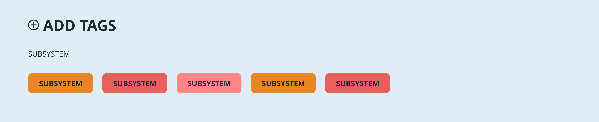

# Jiskefet

This project aims to create a working demo for an enhancement of the ALICE logging system, created in collaboration between the UASA and CERN.

This demo is a collaboration between [Chelsea Doeleman](https://github.com/ChelseaDoeleman), [Robin Stut](https://github.com/RobinStut) and [Maikel van Veen](https://github.com/Maikxx).

## Table of contents

* [Installation](#Installation)
    * [Folder structure](#Folder-structure)
    * [Extra documentation](#Extra-documentation)
* [Features](#Features)
* [Design](#Design)
* [Process](#Process)
* [Issues](#Issues)
* [Recourses](#Recourses)
* [License](#License)

## Installation

* Make sure to install [yarn](https://yarnpkg.com/en/) or [npm](https://www.npmjs.com).
* Make sure the **port** specified in the [package.json](package.json) is available (defaults to 5430).

* Clone the repository: `git clone git@github.com:Maikxx/jiskefet.git`
* Navigate into the directory: `cd jiskefet`
* Install dependencies: `yarn` or `npm install`
* Start the client with: `yarn start-client` or `npm run start-client`
* Start the server with `yarn start-server` or `npm run start-server`

You may have perform the following steps if you get errors running the commands above:

* `npm install typescript -g`
* `npm install ts-node-dev -g`
* `npm install parcel-bundler -g`

* Rename the process environment file to `.env` by doing `cp ./server/.env.example ./server/.env`

The port that now opens is `localhost:5430`.

### Folder structure

Both the clients `src/sass` and `src/scripts` folders should have the following structure:

* components
    * atoms
    * molecules
    * organisms

### Extra documentation

* You can find the atomic design principles [here](./docs/ATOMIC.md).
* You can view the project overview [here](./docs/PROJECT_OVERVIEW.md).

## Features

* Real-time creating tags
* Real-time editing tags
* Real-time removing tags
* Log creation system redesign
* Ability to change the language of the whole page to one of the 14 most used languages.
* Dark / Light mode
* Editor (wysiwyg) that converts to markdown
* Better error handling

## Design

Looking at the corporate identity of [CERN](https://home.cern/) you find that they use a lot of blue, orange and greys. For this project we choose to go with the blue color for the dark theme, because blacks and a too high contrast can cause an eye strain. For the details in this page we used orange and color-variations that match the color or orange.

We really wanted to create a dark theme, so that users who work at night are able to give their eyes some rest by choosing the dark theme. Because not all workers will use this ALICE logging system at night, we also created a light theme for people working during the day, or those who just fancy a light theme. So that when the environment has too much light coming in, the user is still able to view their screen perfectly. For the light theme we also used a variation on the blue color, because white can also cause an eye strain.

Here we provide some sketches of our initials design. During development there were some iterations, you can view this in the application.

    
Sketches Dark theme

    
Sketches Light theme

To create an application for all users that will use the ALICE logging system, we made sure the user is able to change the language to what they are most comfortable with.

### Design princicples

These are some of the design principles we used and would like to hightlight.

**Keep users in control**
_"The obvious almost never is"_. To provide the user some feedback after some actions, we created a pop up message on the screen so that the user knows if their action succeeded or failed.

**Keep secondary actions secondary**
The main function of the logging page is creating a log in the _text-editor_. That's why tags and attachments come in second and why they are positioned beneath the text-editor.

**Progressive disclosure**
For example the **trashcan** button when editing a **generic tag**. Obviously this will delete the tag, but by providing the user with a **modal** explaining the consquences of what will happen when they click, they get more information about this action. The modal becomes visible only when requested (by pressing the trashcan button), so we don't over-explain all the elements in the interface and provide a more error-prone page.

## Process

* [ ] Enable typing markdown directly
* [ ] Fix wysiwy edge cases and styling
* [X] Documentation
* [X] Editing tags
* [X] Error toasts
* [X] Remove tag confirm modal
* [X] Restrict tags by name duplicated

### Extra features for later iterations

* [ ] Animations
* [ ] Autospelling check for tag names
* [ ] Drag & drop attachment
* [ ] Refactor client-side code into components
* [ ] Tag restriction - only some people can create

## Recourses

* Icons
    * [Lamp](https://www.flaticon.com/free-icon/lamp_1437117)
    * [Docs](https://www.flaticon.com/free-icon/docs_1295567)
    * [Trashcan](https://www.flaticon.com/free-icon/garbage_126468)
    * [Confirm](https://www.flaticon.com/free-icon/confirm_101022)
    * [Edit](https://www.flaticon.com/free-icon/pen_1159725)
    * [Remove](https://www.flaticon.com/free-icon/remove_1103478)
* Colors
    * [MyColorSpace](https://mycolor.space/?hex=%231C2C38&sub=1)
* Modal
    * [React-modal](https://github.com/reactjs/react-modal)
    * [@types/react-modal](https://www.npmjs.com/package/@types/react-modal)

## License

This repository is licensed as [MIT](LICENSE) by [Chelsea Doeleman](https://github.com/ChelseaDoeleman), [Robin Stut](https://github.com/RobinStut) and [Maikel van Veen](https://github.com/maikxx).