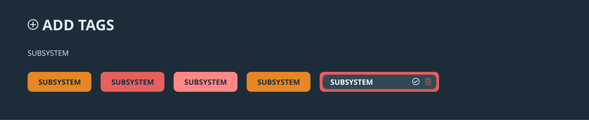

# Jiskefet

This project aims to create a working demo for an enhancement of the ALICE logging system, created in collaboration between the UASA and CERN.

This demo is a collaboration between [Chelsea Doeleman](https://github.com/ChelseaDoeleman), [Robin Stut](https://github.com/RobinStut) and [Maikel van Veen](https://github.com/Maikxx).

## Table of contents

* [Installation](#Installation)
    * [Folder structure](#Folder-structure)
    * [Extra documentation](#Extra-documentation)
* [Features](#Features)
* [Design](#Design)
* [Process](#Process)
* [Issues](#Issues)

## Installation

* Make sure to install [yarn](https://yarnpkg.com/en/) or [npm](https://www.npmjs.com).
* Make sure the **port** specified in the [package.json](package.json) is available (defaults to 5430).

* Clone the repository: `git clone git@github.com:Maikxx/jiskefet.git`
* Navigate into the directory: `cd jiskefet`
* Install dependencies: `yarn` or `npm install`
* Start the client with: `yarn start-client` or `npm run start-client`
* Start the server with `yarn start-server` or `npm run start-server`

You may have perform the following steps if you get errors running the commands above:

* `npm install typescript -g`
* `npm install ts-node-dev -g`
* `npm install parcel-bundler -g`

* Rename the process environment file to `.env` by doing `cp ./server/.env.example ./server/.env`

The port that now opens is `localhost:5430`.

### Folder structure

Both the clients `src/sass` and `src/scripts` folders should have the following structure:

* components
    * atoms
    * molecules
    * organisms

### Extra documentation

* You can find the atomic design principles [here](./docs/ATOMIC.md).
* You can view the project overview [here](./docs/PROJECT_OVERVIEW.md).

## Features

* Real-time creating tags
* Real-time editing tags
* Real-time removing tags
* Log creation system redesign
* Ability to change the language of the whole page to one of the 14 most used languages.
* Dark / Light mode
* Editor (wysiwyg) that converts to markdown

## Design

Looking at the corporate identity of cern you find that they use a lot of blue, orange and greys. For this project we choose to go with the blue color for the dark theme, because blacks and a too high contrast can cause an eye strain. For the details in this page we used orange and color-variations that match the color or orange. 

We really wanted to create a dark theme, so that users who work at night are able to give their eyes some rest by choosing the Dark theme. Because we didn't know the exact location where logs will be created in the ALICE system, we also created a light theme. So that when the evironment has to much light coming in, the user is still able to view their screen perfectly. For the light theme we also used a variation on the blue color, because white can also cause an eye strain.

Here we provide some sketches of our initials design. During development there were some itterations, you can view this in the application.

    
Sketches Dark theme

    

    
Sketches Light theme

    

### Design princicples

These are some of the design principles we used and would like to hightlight.

**Keep users in control**
_"The obvious almost never is"_. To provide the user some feedback after some actions, we created an pop up message on the screen so that the user knows when their action worked or failed. 

**Keep secondary actions secondary**
The main function of the logging page is creating a log in the _text-editor_. That's why tags and attachments come secondary and why they are positioned beneath the text-editor. 

**Progressive disclosure**
For example the **trashcan** button when editing a **generic tag**. Obviously this will delete the tag, but by providing the user with a **modal** explaining the consquences of what will happen when they click, they get more information about this action. The modal comes secondary, so we don't over-explain all the elements in the interface.

## Process

* [ ] Animations
* [ ] Autospelling check for tag names (**NOT IN V1**)
* [ ] Drag & drop attachment (**NOT IN V1**)
* [ ] Documentation
* [ ] Enable typing markdown directly
* [ ] Refactor client-side code into components (**NOT IN V1**)
* [ ] Tag restriction - only some people can create (**NOT IN V1**)
* [X] Editing tags
* [X] Error toasts
* [X] Remove tag confirm modal
* [X] Restrict tags by name duplicated

## Issues

* Horizontal line styling
* Blockquote styling
* Refactor `collapsible` into it's own component

## License

This repository is licensed as [MIT](LICENSE) by [Chelsea Doeleman](https://github.com/ChelseaDoeleman), [Robin Stut](https://github.com/RobinStut) and [Maikel van Veen](https://github.com/maikxx).